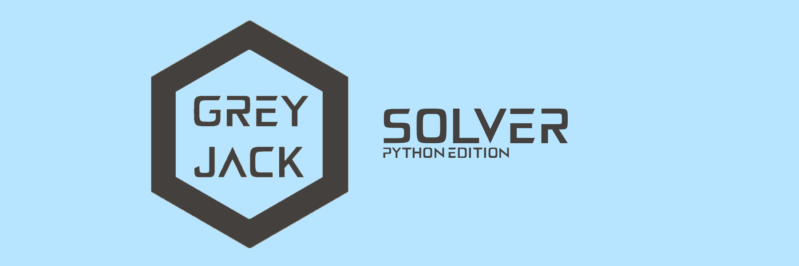

# Preview



_In optimum we trust._

GreyJack Solver is a "jack of all trades" constraint metaheuristic solver for Python, built on the robust foundations of Rust and Polars. It empowers you to tackle a wide array of constraint optimization problems, including continuous, integer, and mixed-integer challenges with ease and efficiency.

# Editions

There are 2 editions of GreyJack Solver:

- Python edition
- [Rust edition](https://github.com/CameleoGrey/greyjack-solver-rust)

# Key Features of GreyJack Solver

- **Unmatched Comfort, Expressiveness, Flexibility and speed of developing** Designed to express almost any optimization problem with maximum comfortability and clarity.
- **Universality** Supports a wide range of constraint problems, including continuous, integer, and mixed-integer challenges. Additionally, thanks to Polars, you can optimize virtually any process that can be represented as table data.
- **Python's Comfort Meets Rust's Speed** All computationally intensive parts of the solver are implemented in Rust and seamlessly integrated into Python, offering fast development cycles with production-ready performance for ~95% real-world tasks.
- **Clarity and Simplicity** GreyJack provides a clear and straightforward approach to designing, implementing, and improving effective solutions for nearly any constraint problem and scenario.
- **Nearly Linear Horizontal Scaling** The multi-threaded solving process is organized as a collective effort of individual agents (using the island computation model for all algorithms), which share results with neighbors during solving. This approach ensures nearly linear horizontal scaling, enhancing both the quality and speed of solutions (depending on agent settings and the problem at hand).
- **Support for Population and Local Search Algorithms** GreyJack Solver supports a wide range of metaheuristics, including population-based and local search algorithms, with highly flexible settings. You can easily find, select, and configure the approach that best fits your problem, delivering optimal results.
- **Easy Integration**  The observer mechanism (see examples) simplifies integration, making it straightforward to incorporate GreyJack Solver into your existing workflows..

# Get started with GreyJack Solver

```
pip install greyjack
```
- Clone data for examples from this [repo](https://github.com/CameleoGrey/greyjack-data-for-examples)
- Explore, try examples. Docs and guides will be later. GreyJack is very intuitively understandable solver (even Rust version).
- Use examples as reference for solving your tasks.

# Supported runtime and native compatibility

GreyJack 0.3.9 requires Python 3.10 or newer. The Python/native compatibility
cohort is Python Polars `>=1.44.2,<1.45`, Rust Polars `0.55.2`,
`pyo3-polars 0.28.0`, and PyO3 `0.29.2`. These components cross the native
DataFrame boundary together; upgrading Python Polars beyond this range requires
a matching native rebuild and interoperability checks.

Source builds require Rust 1.95 or newer. The repository toolchain is pinned to
1.98.1 in `rust-toolchain.toml`; rustup selects it when building this checkout.
CI builds and tests installed wheels for CPython 3.10 through 3.14 on Linux
x86_64 (glibc 2.28+), Windows amd64, and macOS ARM64. Intel macOS is outside the
wheel matrix because mandatory Numba 0.63+ no longer supplies Intel macOS wheels.
The tests resolve dependencies within the supported Polars range and run outside the
checkout and verify the installed package path so local sources cannot conceal
a broken wheel. Workflow configuration describes the checks; successful remote
runs provide the evidence that those checks passed.

CI limits build memory for hosted runners with as little as 7 GB RAM by using
ThinLTO, 16 codegen units, no debug information, and two build jobs. These
workflow-only overrides retain release optimization level 3; local Cargo release
settings are unchanged.

Releases use stripped wheels and one source distribution that is rebuilt and
tested outside the checkout. Branch and manual CI runs only prepare artifacts;
matching `v*` tag pushes attach them to GitHub releases. PyPI publishing remains
manual. See [RELEASING.md](RELEASING.md) for the 0.3.9 changes, artifact inventory,
local build commands, and publishing the exact tested CI files with Maturin.

# Develop GreyJack and run examples locally

Install rustup, the pinned Rust toolchain, Python, and uv. From the repository
root:

```bash
uv sync --project examples --group dev
uv run --project examples --group dev python -m pytest greyjack/tests
uv run --project examples python -m examples.object_oriented.employee_scheduling.scripts.solve_task
```

The examples project declares `greyjack` as an editable dependency at
`../greyjack`, so Python source edits apply to the next process. To rebuild the
native extension after Rust or Cargo changes:

```bash
uv sync --project examples --group dev --reinstall-package greyjack
```

Restart running interpreters after rebuilding the native library. An editable
Python installation does not hot-reload Rust code; see
[uv's local dependency cache behavior](https://docs.astral.sh/uv/concepts/cache/).
The first build compiles the native dependency stack and can take time.

For a separate, activated virtual environment, a direct source installation is
also available from the repository root:

```bash
python -m pip install maturin
python -m maturin develop --release --manifest-path greyjack/Cargo.toml
```

# Solver lifecycle

Agent failures surface as `RuntimeError` in the caller, carrying worker error
details. A failed solve does not silently return a partial success. A normal
stop returns the best available solution, or `None` if no candidate was produced.
`KeyboardInterrupt` requests cleanup and is re-raised so the caller retains
control of Ctrl-C handling.

Process-based solving uses spawn-safe startup. Put solver execution under a
`if __name__ == "__main__":` guard and keep worker-callable code importable.
For example:

```python
def main():
    # Construct and run your solver here.
    pass


if __name__ == "__main__":
    main()
```

Thread callbacks stop cooperatively. A callback that blocks indefinitely cannot
be forcibly interrupted safely; callbacks should finish or observe application
cancellation so solver cleanup can complete.

# RoadMap
- Types, arguments validation
- Write docs
- Tests, tests, tests... + integration wtih CI/CD
- Composite termination criterion (for example: solving limit minutes N AND score not improving M seconds)
- Multi-level score
- Custom moves support
- Website
- Useful text materials, guides, presentations
- Score explainer / interpreter for OOP API
- Reimplement GreyNet in Rust
